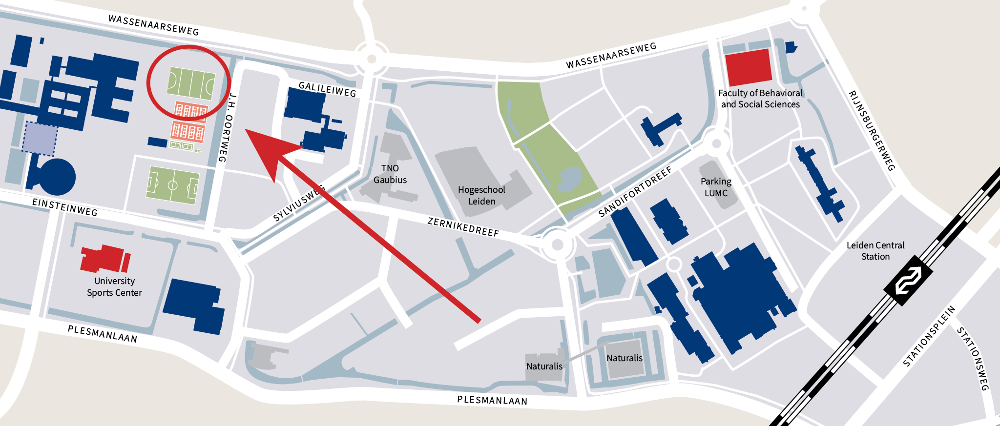

- Location: [University Sports Center (USC) hockey fields](https://maps.app.goo.gl/yWmSJjPauUc7BFiR9)
- Date and time: **Thursday, 6 June 2024 from 15:00 to 20:00.**
- Register your 6-person team [here](https://forms.gle/NgPUYJFZ7BsdUaEW9).

## What is this about?
We are organizing an interdepartmental dodgeball tournament for the different units of the Institute for Psychology of Leiden University. All units are invited to register a 6-person team.

## Approximate schedule
1. 15:00–17:30 Dodgeball tournament
2. 17:30–18:00 Drinks
3. 18:00–20:00 BBQ

## Who are eligible to participate?
Participation is open to teams consisting of 1 to 4 individuals from the Leiden academic community, from BA/BSc students to professors. It's no problem if some team members are not affiliated with Leiden University, so feel free to register with your housemates or friends. We encourage mixed-seniority teams and interdisciplinary teams to apply.

## What does it cost to register?
Participation is free for all participants.

## Questions that you might have

### Why dodgeball and not volleyball or soccer or [insert sport]?
Whereas volleyball or soccer require specific practice before actually being able to meaningfully contribute to your team, dodgeball is a very low-threshold sport that only requires basic hand-eye coordination and the ability to throw a ball. This makes it a perfect sport for everyone to contribute.

### Isn’t dodgeball injury-prone?
No. We will use soft, 22 cm foam balls that do not hurt when being hit and can do no damage with normal play.

### What if I have specific dietary requirements?
We will serve a variety of food, including vegan and vegetarian foods. You can indicate your vegan or vegetarian preference during registration.

### I have another question
If you have any questions that are not answered on this information page, feel free to send an email to Roy de Kleijn: [kleijnrde@fsw.leidenuniv.nl](mailto:kleijnrde@fsw.leidenuniv.nl).
