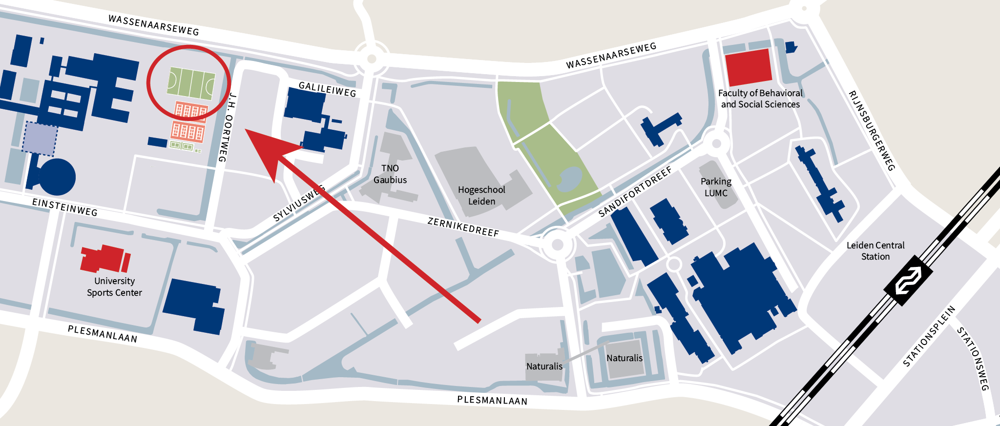

- Location: [University Sports Center (USC) hockey fields](https://maps.app.goo.gl/yWmSJjPauUc7BFiR9)
- Date and time: **Friday, 20 June 2025 from 15:45 to 21:30.**
- Register your 6-player team [here](https://docs.google.com/forms/d/e/1FAIpQLSdOXBk9Is_R509xiL-b41qGZjL5UzEc_qpF9lMglhgfi5DlaQ/viewform?usp=dialog).

## What is this about?
We are organizing an interdepartmental dodgeball tournament for the different units of the Institute for Psychology of Leiden University. All units are invited to register one or more 6-player teams.

<!---
> **Registration is now closed.** If you still want to participate, send me an [email](mailto:kleijnrde@fsw.leidenuniv.nl).
-->

## Approximate schedule
1. 15:45–17:30 Dodgeball tournament
2. 17:30–18:00 Drinks
3. 18:00–21:30 BBQ

## Tournament design
The tournament will have a round-robin design. Each team will compete against all other teams once, with the winner being the team that wins the most games and tie-breaking decided by number of points. The number of rounds will depend on the number of registered teams. Assuming that 7 teams register, there will be 7 rounds with one team having no game each round. If there are 6 teams, we will play 5 rounds. We expect some non-playing attendees to referee the matches being played.

## Who are eligible to participate?
Participation is open to teams consisting of 6 employees from the various units of the Institute for Psychology. If you cannot find enough enthusiastic colleagues to form a team with, you can also register as an independent player. The organizers will then place you in a team.

<!---
As of 30 May, six teams have registered:
- ABO 1
- ABO 2
- Cognitive Psychology
- Methods & Statistics
- Labyrint
- Institute
-->

## What does it cost to register?
Participation is free to all players, this includes the BBQ afterwards. However, it does not include drinks, which can be purchased from the USC cafeteria.

## Questions that you might have

### Why dodgeball and not volleyball or soccer or [insert sport]?
Whereas volleyball or soccer require specific practice before actually being able to meaningfully contribute to your team, dodgeball is a very low-threshold sport that only requires basic hand-eye coordination and the ability to throw a ball. This makes it a perfect sport for everyone to contribute.

### Isn’t dodgeball injury-prone?
No. We will use soft, 22 cm foam balls that do not hurt when being hit and can do no damage with normal play.

### What if I have specific dietary requirements?
We will serve a variety of food, including vegan and vegetarian foods. You can indicate your vegan or vegetarian preference during registration.

### I have another question
If you have any questions that are not answered on this information page, feel free to send an email to Roy de Kleijn: [kleijnrde@fsw.leidenuniv.nl](mailto:kleijnrde@fsw.leidenuniv.nl).
